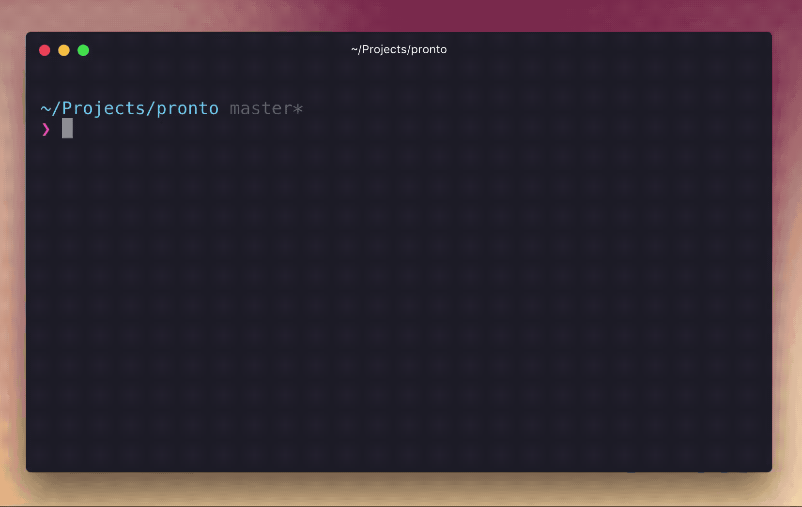

<br>
<br>

⚡ Pronto is a working concept for deploying databases, the same way [Now](https://zeit.co/now) by Zeit revolutionized deployment of apps, servers and well... pretty much everything. Nowadays, to create a new database deployment in the cloud you need to visit provider's admin panel, deploy a database, copy credentials, go back to code and insert them. Pronto simplifies the first steps by automatically creating a database in the cloud on [Compose](https://compose.io), saving certificate to the current directory and providing you a set of credentials.




## Install

```
$ npm install --global vadimdemedes/pronto
```


## Usage

```
$ pronto
```


## License

MIT © [Vadim Demedes](https://github.com/vadimdemedes)
